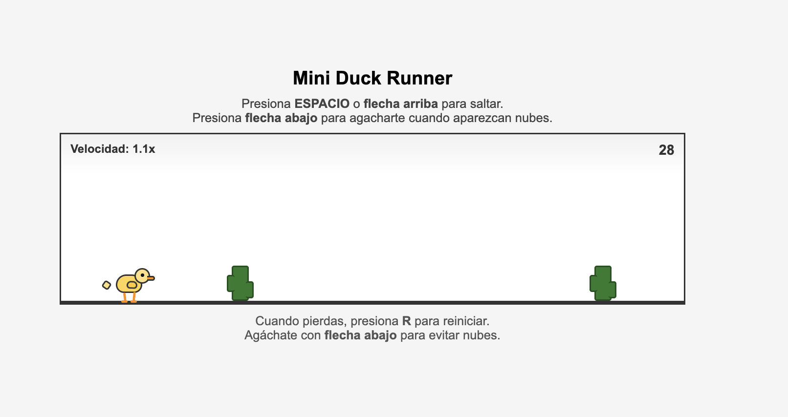

```markdown
# Duck Runner

Juego estilo Chrome Dino Runner, pero con un pato como personaje principal. Desarrollado con HTML, CSS y JavaScript.

El objetivo del juego es saltar los obstáculos y sobrevivir el mayor tiempo posible mientras la velocidad aumenta progresivamente.

## Controles del juego

| Tecla | Acción |
|-------|--------|
| Espacio | Saltar |
| ↑ Flecha arriba | Saltar |
| R | Reiniciar el juego |

## Tecnologías utilizadas

- HTML5: estructura del juego
- CSS3: diseño del pato, animaciones y estilo del juego
- JavaScript (Vanilla JS): lógica del juego

No utiliza frameworks ni librerías externas.

## Estructura del proyecto

```
jumpDuck
├── index.html
├── styles.css
├── script.js
└── README.md
└── assests
```
## Cómo ejecutar el proyecto

Abre el archivo `index.html` directamente en tu navegador o usando Live Server en VS Code.

## Desarrollo

Este proyecto fue creado como un ejercicio simple para practicar JavaScript.
* Manipulación del DOM
* Animaciones con CSS
* Lógica básica de videojuegos


# Mejoras futuras

Algunas mejoras que podrían agregarse:

* Efectos de sonido
* Guardar puntuación máxima
* Modo noche
* Más animaciones del pato
* Diferentes tipos de obstáculos
```

**GitHub Pages:**  
https://luiscontrerasglz.github.io/jumpDuck/

